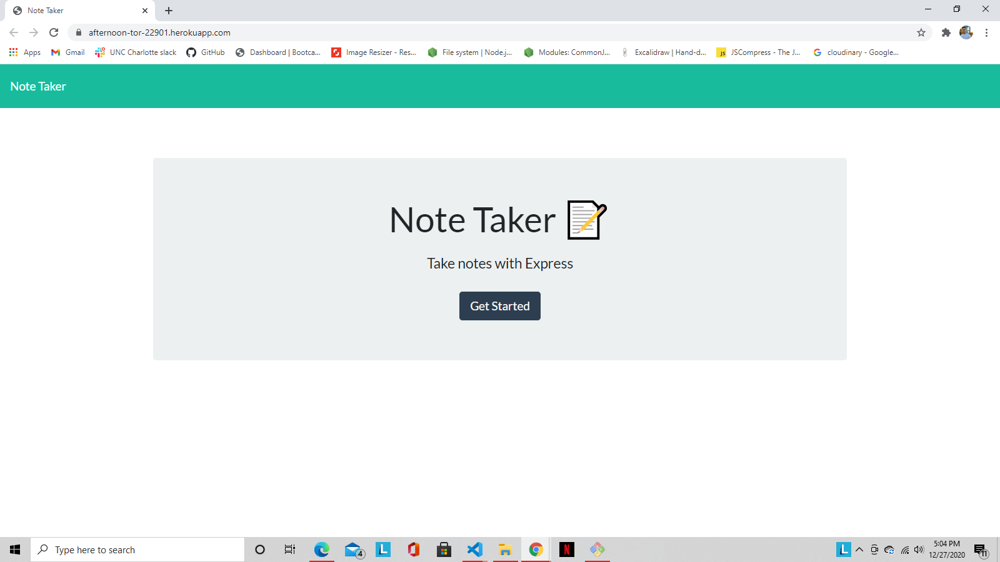

# Title
  Note Taker
  

  ## Developer:
  Jesse Ziros

  ## Description
  This application allows you to create notes and delete notes in a organized order

  ## Table
  * [Installation](##Installation)
  * [Usage](##Usage)
  * [Questions](##Questions)
  * [Contributing](##Contributing)
  * [License](##License)
  * [Test](##Test)

  ## Installation
  The project utilizes html and api routes to be able to comminicate to the database stored in the app.

  ## Usage
  When the application is loaded it will take you to a home screen where you will click a button to take you to the note taking page. From there you can create new notes, inspect the notes created, and delete them when necessary.
  
  

  ## Questions
  If you have any questions contact me at:

  jtziros2020@gmail.com
  
  *[Github Username]
  jesseziros

  ## Contributing
  N/A

  ## License
  MIT

  ## Test
  N/A
